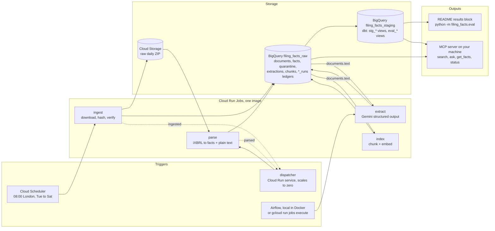

# Filing Facts

[](https://github.com/Raghav-arneja/filing-facts/actions/workflows/ci.yml)

A GCP-native data pipeline that ingests UK Companies House iXBRL accounts, extracts
financial facts with an LLM, and scores that extraction against the XBRL tags that ship
inside the same documents. The XBRL tags are the ground truth, so the evaluation numbers are
real rather than vibes.

This repository is a public portfolio project built on public data. Design rationale and the
staged build plan are in [PROJECT-BRIEF.md](PROJECT-BRIEF.md). It was built stage by stage
with Claude Code as a pair, every diff reviewed before merge; everything that went wrong on
the way, including what the review caught and what it did not, is in
[docs/corrections.md](docs/corrections.md).

**Status: Stages 1 to 6 complete.** Each publication morning:

- one Cloud Run Job fetches the daily Companies House accounts ZIP into Cloud Storage,
  records it in BigQuery and publishes an event;
- a dispatcher hears the event and starts a second job, which parses a capped sample of the
  filings into `documents`, `facts` and `quarantine` tables;
- on demand, a third job asks Gemini on Vertex AI to extract the headline facts from the
  plain text, storing every answer with its measured cost;
- dbt views and tests sit over all of it, and an evaluation layer scores every extracted
  value against the filing's own XBRL tags;
- a fourth job embeds the filing text so it can be searched by meaning, and a local MCP
  server answers questions over it with citations.


## Architecture

Solid arrows are data. Dashed arrows are Pub/Sub events. Every job appends to a ledger table
and never edits it; the ledgers are the source of truth and everything else is derived.



The dispatcher can also start `extract` on a `parsed` event; that flag defaults off because
extraction spends money. A second Pub/Sub channel carries one message per parsed document
into a BigQuery events table; nothing consumes it yet, it exists so flow and queue age are
observable and so a per-document consumer can be added without touching the producer.

## Results

In plain terms: given only the printed text of a set of accounts, the cheapest model got about
95 of every 100 checkable numbers exactly right, for about a third of a US cent per filing.
The tables below are generated from the evaluation views over every extraction run so far;
the prose around them is the reading.

- **The cheap model wins.** Flash-Lite at 3 US dollars per 1,000 filings out-scores Flash at
  18, on the same 300 filings, on every headline number. Flash's extra thinking tokens buy
  latency, not accuracy, on this task.
- **One prompt rule was worth 1.8 points.** Every creditors error under prompt v1 was a sign
  flip: the prompt said brackets mean negative, and accounts print creditors in brackets
  while the taxonomy stores them as positive amounts. Prompt v2 states the taxonomy's sign
  convention and took creditors from 54.5 to 97.4 percent recall. Flash was not rerun on v2
  because the Stage 4 budget was spent; its creditors row is the v1 defect, not the model.
- **Some of the answer key is wrong, and the harness says so.** 344 employee-count facts in
  the filings carry a scale of minus two, tagging 2 employees as 0.02; the model read the
  page correctly. Those cells are reported as tag errors, not scored either way. Negative
  equity is sometimes tagged without its sign; those are counted against the model because
  the harness cannot prove which side is right.
- **Thinking could not be switched off.** The row labelled `@t0` set a zero thinking budget,
  which the model ignored (2,643 mean thinking tokens against 2,330 by default). It is kept
  as a null result.
- **Length matters at both ends.** Recall is lowest on the longest filings, over 15,000
  characters, and on the shortest, where dormant-company accounts state very little.

<!-- eval:start -->
_Computed from the evaluation views on 2026-09-08 by `python -m filing_facts.eval`. Every figure below is generated; CI fails if this section is stale._

**Headline: exact-match recall of extracted facts against the XBRL tags**

| Model / prompt | Filings | Verifiable cells | Recall | Precision | Unsupported | Tag errors | USD per 1,000 | Mean latency |
|---|---:|---:|---:|---:|---:|---:|---:|---:|
| gemini-3.1-flash-lite / v2 | 302 | 3265 | 94.8% | 95.6% | 576 | 34 | 3.31 | 3.9 s |
| gemini-3.1-flash-lite / v1 | 321 | 3538 | 93.0% | 93.9% | 594 | 39 | 3.28 | 3.7 s |
| gemini-3.8-flash@t0 / v1 | 100 | 1050 | 91.1% | 92.1% | 147 | 8 | 19.06 | 25.2 s |
| gemini-3.8-flash / v1 | 300 | 3255 | 90.3% | 91.1% | 411 | 34 | 17.83 | 21.8 s |

Verifiable cells are those where the filing's own tags give an answer. Unsupported cells are values the model gave where the tags are silent; they are reported, not scored. Tag errors are cells where the tag is demonstrably wrong and the model is not, such as employee counts filed with a scale of minus two.

**Recall by concept**

| Concept | gemini-3.1-flash-lite / v2 | gemini-3.1-flash-lite / v1 | gemini-3.8-flash@t0 / v1 | gemini-3.8-flash / v1 |
|---|---:|---:|---:|---:|
| Equity | 94.0% (n=497) | 94.6% (n=523) | 95.5% (n=176) | 94.3% (n=495) |
| Net assets | 94.8% (n=465) | 95.5% (n=484) | 94.7% (n=151) | 94.2% (n=462) |
| Net current assets | 93.5% (n=433) | 93.7% (n=475) | 92.6% (n=135) | 94.2% (n=432) |
| Total assets less current liabilities | 93.9% (n=413) | 94.8% (n=460) | 94.9% (n=137) | 93.4% (n=412) |
| Current assets | 95.5% (n=398) | 95.7% (n=437) | 96.6% (n=119) | 97.7% (n=397) |
| Fixed assets | 93.8% (n=227) | 95.2% (n=251) | 95.7% (n=70) | 93.8% (n=226) |
| Creditors due within one year | 97.4% (n=195) | 54.5% (n=209) | 18.2% (n=55) | 15.4% (n=195) |
| Cash at bank | 94.6% (n=223) | 96.3% (n=246) | 97.2% (n=72) | 96.0% (n=223) |
| Average employees | 96.9% (n=414) | 97.8% (n=453) | 95.6% (n=135) | 97.3% (n=413) |

**How the wrong answers were wrong**

| Model / prompt | sign flipped | off by a factor of 1,000 | current and prior swapped | within 1 percent | other |
|---|---:|---:|---:|---:|---:|
| gemini-3.1-flash-lite / v2 | 80 | 22 | 2 | 6 | 31 |
| gemini-3.1-flash-lite / v1 | 168 | 22 | 0 | 7 | 18 |
| gemini-3.8-flash@t0 / v1 | 60 | 8 | 0 | 0 | 14 |
| gemini-3.8-flash / v1 | 236 | 22 | 0 | 0 | 28 |

**Recall by filing length**

| Model / prompt | under 2k chars | 2k to 5k | 5k to 15k | over 15k |
|---|---:|---:|---:|---:|
| gemini-3.1-flash-lite / v2 | 94.0% (n=134) | 96.7% (n=72) | 97.5% (n=85) | 70.4% (n=11) |
| gemini-3.1-flash-lite / v1 | 89.1% (n=143) | 93.8% (n=74) | 98.1% (n=95) | 76.7% (n=9) |
| gemini-3.8-flash@t0 / v1 | 90.5% (n=42) | 92.9% (n=24) | 93.7% (n=28) | 79.1% (n=6) |
| gemini-3.8-flash / v1 | 89.2% (n=133) | 90.7% (n=72) | 94.3% (n=84) | 67.6% (n=11) |

<!-- eval:end -->

How a verdict is reached is in [Stage 4](#stage-4-evaluation-against-the-xbrl-tags) below.

## What this demonstrates

| Asked for in London AI Engineer postings | Where it is in this repository |
|---|---|
| Evaluations with real ground truth | [dbt/models/eval/](dbt/models/eval/), the results block above, [docs/eval.md](docs/eval.md) |
| Model comparison on accuracy, cost and latency | `eval_metrics` view; `compare_models` MCP tool; [docs/cost.md](docs/cost.md) |
| Structured outputs and schema validation | [src/filing_facts/extract/schema.py](src/filing_facts/extract/schema.py), [model.py](src/filing_facts/extract/model.py) |
| Prompts as versioned, tested artefacts | [prompts/](prompts/), prompt id carries a content hash on every row |
| RAG over a real corpus | [src/filing_facts/index/](src/filing_facts/index/), BigQuery `VECTOR_SEARCH`, cited answers |
| MCP tool server | [src/filing_facts/mcp/](src/filing_facts/mcp/) |
| GCP hands-on: BigQuery, Vertex AI, Cloud Run, Pub/Sub, Scheduler, Monitoring, Trace | [infra/stage1/](infra/stage1/) |
| Terraform, CI/CD, no secrets | two Terraform roots, [ci.yml](.github/workflows/ci.yml), Workload Identity Federation |
| Docker | one image, four jobs and a service, same entrypoint locally and on Cloud Run |
| Observability and alerting | [telemetry.py](src/filing_facts/telemetry.py), [alerts.tf](infra/stage1/alerts.tf), the runbook below |
| Idempotency, quarantine, backfill | every job; [tests/test_idempotency.py](tests/test_idempotency.py); [airflow/dags/filing_facts_backfill.py](airflow/dags/filing_facts_backfill.py) |
| Production Python | 3.12, Pyright strict, Ruff, a test suite that runs with no cloud and no cost |

## Roadmap

Each stage is independently shippable and landed as its own pull request.

| Stage | Scope | Status |
|---|---|---|
| 1 | Ingestion: daily ZIP to Cloud Storage, run ledger in BigQuery, Terraform, CI | Done |
| 2 | Parse iXBRL filings, strip tags to plain text, quarantine table, dbt staging models | Done |
| 3 | LLM extraction on Vertex AI against a Pydantic schema, confidence handling, local Airflow | Done |
| 4 | Evaluation harness: extracted facts scored against XBRL ground truth, model comparison | Done |
| 5 | Pub/Sub event channels, backfill DAG, observability and alerting | Done |
| 6 | RAG over filing text and an MCP server for natural-language queries | Done |

What is not done is listed under [Follow-ups](#follow-ups).

## How it works

Four patterns repeat in every job, so the six stages read as variations on one shape:

1. **A ledger per job.** A `started` row pins the batch (the exact items taken on) before any
   data write; a `succeeded`, `failed` or `skipped_existing` row closes it. Nothing is ever
   deleted from a ledger.
2. **Idempotent loads through job ids.** Every BigQuery write is a batch load whose job id is
   derived from the batch and attempt. BigQuery rejects a duplicate job id, so a replay cannot
   duplicate rows. See [storage/bigquery.py](src/filing_facts/storage/bigquery.py).
3. **Quarantine, never drop.** Anything a stage cannot process becomes a row in `quarantine`
   with the stage, a reason and the error. A backfill releases rows rather than deleting them.
4. **Protocol boundaries.** Storage, the model and the publisher are Python Protocols with
   production and in-memory implementations, which is why the tests need no cloud.

### Stage 1: ingest

```
Cloud Scheduler (08:00 Europe/London, Tue-Sat)
      |  OAuth-authenticated POST to jobs.run
      v
Cloud Run Job: ingest  (1 vCPU, 1 GiB, plain Python)
      |  1. ledger says already succeeded for today's file?  -> exit 0, no download
      |  2. stream ZIP to disk, hash it, check Content-Length and size cap
      |  3. validate the ZIP central directory and every member CRC
      |  4. create-only upload to GCS (if_generation_match=0)
      |  5. batch-load one run row to BigQuery with a deterministic job id
      |  6. publish "ingested" on the lifecycle topic (best effort, after the ledger row)
      v
gs://<project>-raw/companies_house/accounts_daily/Accounts_Bulk_Data-YYYY-MM-DD.zip
<project>.filing_facts_raw.ingest_runs
```

Every outcome is recorded, including failure. The ledger row for a `failed` run carries the
exception type and message. Nothing is dropped silently.

The document id for Stage 1 is the source filename. Three independent mechanisms stop a replay
from duplicating anything:

1. The job checks the ledger for a `succeeded` row before downloading.
2. The GCS write uses a generation precondition, so a second writer cannot overwrite.
3. The BigQuery write is a batch load job whose job id is derived from the source key.
   BigQuery rejects duplicate job ids, so even two runs racing past check 1 append one row.

If a run dies after the GCS write and before the ledger write, the next run re-downloads,
compares hashes with the stored object, and records success only if they match. A mismatch is
recorded as a failure and left for a human. The test suite exercises each of these paths;
see [tests/test_idempotency.py](tests/test_idempotency.py).

### Stage 2: parse

```
Pub/Sub "ingested" event -> dispatcher -> Cloud Run Job: parse --source-key <zip>
      |  1. which ingested ZIPs have no success at the current cap?
      |  2. pin a batch: a `started` ledger row listing the chosen members
      |  3. per filing: parse XML once -> tagged facts (answer key) + plain text (exam paper)
      |     unparseable -> quarantine row with the reason; never dropped
      |  4. rows spool to disk; three batch loads under deterministic job ids
      |  5. `succeeded` ledger row; publish "parsed" and one event per document
      v
filing_facts_raw.documents / facts / quarantine / parse_runs
```

The parse job has no schedule of its own: the dispatcher starts it when ingest publishes.
A replay resumes the pinned batch, so the same load-job ids are reused and BigQuery rejects
the duplicates. The parser records every tag occurrence: the same fact commonly appears in a
balance sheet and again in a note, so `facts` holds one row per occurrence and the dbt layer
reduces that to one row per fact with a test that occurrences agree. The document id from
here on is `<company number>_<period end YYYYMMDD>`, parsed from the member filename.

The parse job processes `FF_PARSE_CAP` filings per ZIP (Terraform variable `parse_cap`,
default 500), chosen deterministically by a hash of the document id so raising the cap later
adds documents without reshuffling the ones already parsed.

### Stage 3: extraction with Gemini on Vertex AI

```
Airflow (local, Docker), the dispatcher (if extract_on_event), or `gcloud run jobs execute extract`
      v
Cloud Run Job: extract
      |  1. up to FF_EXTRACT_CAP documents with no answer yet for this (model, prompt)
      |  2. pin the batch: a `started` ledger row listing document ids
      |  3. per document: Gemini, structured output against the Pydantic schema,
      |     temperature 0, billing labels; tokens and cost recorded from the response
      |  4. schema failure, empty or truncated answer, call failure -> quarantine
      |     low confidence -> kept and quarantined
      |  5. `succeeded` ledger row with measured cost
      v
filing_facts_raw.extractions / extract_runs / quarantine
```

Prompts are versioned files in `prompts/extract/`; the version and a content hash travel with
every row. The model boundary is a Protocol, so tests run against a fake and cost nothing.
A resume processes only pinned documents with no row yet, so no answer is paid for twice.
The job stores the validated JSON only; dbt derives the flattened values. Money values are
strings, not JSON numbers, and a value the normaliser cannot read unambiguously is a
quarantine row rather than a guess.

```bash
make dbt-parse
uv run python -m filing_facts.extract --dry-run --fake --cap 5     # no GCP, no model calls
gcloud run jobs execute extract --region europe-west2 --project $PROJECT --wait
gcloud run jobs execute extract --region europe-west2 --project $PROJECT --wait \
  --args="--model,gemini-3.8-flash,--cap,50"
```

The current Gemini Flash line is served from Vertex's `global` endpoint only; europe-west2
offers 2.5 Flash alone. Filing text therefore leaves the region for inference. It is public
data.

#### Airflow, locally in Docker

Per the locked decision, orchestration from Stage 3 runs on Apache Airflow in Docker rather
than Cloud Composer, which bills continuously. Cloud Scheduler fires ingest each morning and
the dispatcher starts parse from the event; Airflow runs the full chain on demand, runs
extraction (never scheduled, because it spends money), and runs backfills. The DAG code is
what would run on Composer unchanged.

- `filing_facts_daily`: ingest, parse, extract as Cloud Run job executions, with the model,
  prompt and cap as run parameters.
- `filing_facts_backfill`: marks the quarantine rows for one stage and reason as released,
  which keeps them as history but stops them counting as processed, then reruns the stage:
  parse once per affected source, extract for the chosen model and prompt. Released
  documents go first in both jobs' selection. It also drains the dead-letter subscription,
  replaying or purging.

```bash
make airflow-up          # http://localhost:8080; authenticates to GCP with your ADC
make airflow-test        # DAG integrity tests inside the Airflow image; CI runs this
make airflow-trigger CONF='{"extract_cap": 20}'
make airflow-down
```

### Stage 4: evaluation against the XBRL tags

The harness is three dbt models in [dbt/models/eval/](dbt/models/eval/) and a report module
that writes them into this README.

1. `eval_ground_truth` picks one tagged value per document, concept and period: non-dimensional
   facts only (creditors is the "within one year" member, because that is what the prompt
   asks for), dated on the balance sheet date for the current period and earlier for the
   prior, excluding facts whose own occurrences disagree.
2. `eval_scores` joins every extracted cell to that truth and gives it a verdict:

   | Outcome | Meaning | Scored? |
   |---|---|---|
   | `correct` | value equals the tag exactly | yes |
   | `wrong` | both present, different; `error_type` says how: sign flipped, factor of 1,000, periods swapped, within 1 percent, other | yes |
   | `missed` | the tag exists, the model returned null | yes, against recall |
   | `unsupported` | the model gave a value, the filing tags nothing for that cell | reported, not scored |
   | `tag_error` | the tag is demonstrably wrong (a count with scale minus two) and the model is not | reported, not scored |

3. `eval_metrics` and `eval_metrics_by_size` aggregate per model, prompt, concept and filing
   length. Recall is `correct / (correct + wrong + missed)`; precision is
   `correct / (correct + wrong)`. Cost and latency come from the extraction rows.

`python -m filing_facts.eval --write` renders the views between the `eval:start` and
`eval:end` markers above and into [docs/eval.md](docs/eval.md). CI runs `--check` against a
dataset it has just built; a stale block fails the build. That is how "every number is
computed, not typed" is enforced rather than promised.

```bash
make eval                # regenerate the README block from BigQuery
make eval-check          # what CI runs
```

### Stage 5: events, dispatcher and alerts

```
08:00 London  Cloud Scheduler -> ingest job
                  |  publishes "ingested" on the lifecycle topic
                  v
              Pub/Sub push -> dispatcher (Cloud Run service, private, scales to zero)
                  |  starts the parse job for that source
                  v
              parse job -> one "documents" message per parsed filing -> BigQuery subscription
                  |  publishes "parsed"; extract starts only if extract_on_event is on
                  v
              extract job (manual, or Airflow, or the flag) -> publishes "extracted"
```

Every event is validated against a versioned schema. A message the dispatcher cannot handle
is answered 400; Pub/Sub retries five times with backoff, then moves it to the dead-letter
topic. A transient failure, or a job that is already running, is answered 503 and retried.
The dispatcher starts at most one execution per job at a time, so a redelivered event cannot
start a concurrent duplicate. Every job is idempotent, so a replayed event costs a no-op run.
Publishing happens after the ledger's success row and never raises: a lost event is
replayable from the ledger, but an event for something the ledger does not record cannot be
trusted.

Traces: one span per job run and one per document, in Cloud Trace, linked from every log
line's trace field. Metrics behind the alerts: Pub/Sub dead-letter sends, oldest unacked
message age, Cloud Run failed execution count. Alerts email the address in the
`alert_email` Terraform variable.

### Stage 6: retrieval over the filings, and an MCP server

A fourth job, `index`, splits each filing's text on line boundaries into passages of about
1,500 characters with a three-line overlap, embeds them with `gemini-embedding-2`
(768 dimensions, `RETRIEVAL_DOCUMENT`) and loads them into a `chunks` table. Batches are
pinned in an `index_runs` ledger and loads are keyed on batch, attempt and part, so a crash
keeps every chunk already loaded and a resume pays only for the rest. Search embeds the
question as `RETRIEVAL_QUERY` and runs BigQuery `VECTOR_SEARCH` with cosine distance; at
this corpus size brute force answers in a few seconds and needs no vector index, which
would bill by the hour whether or not anyone asked a question.

```bash
uv run python -m filing_facts.index --dry-run --fake --cap 5      # no GCP, no model calls
gcloud run jobs execute index --region europe-west2 --project $PROJECT --wait
uv run python -m filing_facts.index --search "furniture maker with no employees" --k 3
```

An [MCP](https://modelcontextprotocol.io) server exposes the pipeline to any chat client
that speaks the protocol. It runs on your machine over stdio with your own credentials;
nothing is deployed. Six tools:

| Tool | What it reads |
|---|---|
| `search_filings` | nearest passages by meaning, with a citation key per passage |
| `ask` | a grounded answer from Gemini Flash-Lite, every claim cited, cost reported |
| `get_facts` | the XBRL ground truth for one filing |
| `get_extraction` | what the model extracted, next to the truth and the harness verdict |
| `compare_models` | precision, recall, error types and cost per 1,000 filings by model |
| `pipeline_status` | counts, last successful run per stage, open quarantine, spend |

```bash
claude mcp add filing-facts -e FF_GCP_PROJECT=$PROJECT -- \
  uv run --directory "$PWD" python -m filing_facts.mcp
```

Then, in Claude Code: "which dormant companies have called-up share capital under £10?"
The answer arrives with keys like `[14508432_20251130#0]`; `get_facts` on that document
shows the tagged figure the passage came from. The answer prompt lives in
`prompts/ask/` and is versioned like the extraction prompts. Without a chat client:

```bash
uv run python -m filing_facts.mcp --ask "which dormant companies have share capital under 10 pounds?"
make demo                # re-records docs/demo.gif with vhs; one paid question
```

What a question costs and what indexing cost are in [docs/cost.md](docs/cost.md), measured
from the ledgers. The answer is only as good as retrieval: `ask` ranks passages by cosine
distance alone, so a question that names a company may pull in a lookalike. The citation
keys make that visible, which is the point of them.

## Runbook: what breaks, how it is detected, what to do

| What breaks | How you find out | What to do |
|---|---|---|
| The daily file is not published | Ingest ledger row `not_published`; no event | Nothing. Companies House publishes Tuesday to Saturday; holidays skip. |
| Ingest, parse or extract exits non-zero | Alert: failed execution, within 10 minutes | Read the ledger row's `error`, open the execution's trace from the log line's trace id. Rerun the job by hand; it resumes its pinned batch. |
| A malformed or unknown-version event | Alert: dead letter, within 10 minutes | Pull it from the dead-letter subscription, read `event_rejected` in the dispatcher logs, fix the producer, replay with the backfill DAG's dead-letter task. |
| Dispatcher down or a job stuck running | Alert: lifecycle message unacknowledged for an hour | Check the service's revisions and the job's executions; cancel a stuck execution; Pub/Sub redelivers on its own once the dispatcher answers. |
| A filing that cannot be parsed or extracted | Quarantine row with a reason; dbt tests reconcile counts | Fix the parser or prompt, release the rows with the backfill DAG; the jobs pick released documents up first. |
| The model answers where the tags are silent, or the tags are wrong | Evaluation views: `unsupported` and `tag_error` counts | Reported in the README; not scored either way. |
| Spend | Budget alert email at the billing account | Extraction never runs on a schedule; the on-event flag defaults off. |

Replaying anything is safe. Ledger rows are the source of truth; events and executions are
derived from them and duplicate nothing.

## What is deliberately not here

No Cloud Composer, no Dataflow, no Apache Beam, no streaming inserts, no managed vector
index. One daily ZIP fits on one small machine, and a single-developer project does not need
a managed control plane billing by the hour. Sizing the tool to the problem is the point;
see section 11 of the brief for each decision and what it replaced.

## Prerequisites

Manual steps that sit outside Terraform by design. Everything else is code.

1. **A GCP project with billing enabled.** Terraform never creates or deletes the project.
2. **A budget alert on the billing account.** Budgets attach to the billing account, not the
   project, so they are set by hand in Billing > Budgets & alerts. This project runs with an
   alert at GBP 1 and treats any email from it as a bug.
3. **Local tools:** `gcloud`, Terraform 1.9+, Docker, `uv`, `make`, `gitleaks` (optional). dbt is
   installed by `uv sync` as a dev dependency.
   ```bash
   brew install --cask google-cloud-sdk docker
   brew install hashicorp/tap/terraform uv gitleaks
   ```
4. **Authenticate once.** Terraform and the local job both use Application Default Credentials.
   ```bash
   gcloud auth login
   gcloud auth application-default login
   gcloud config set project filing-facts-gb
   gcloud auth configure-docker europe-west2-docker.pkg.dev
   ```

## Run it locally with no GCP at all

```bash
uv sync --frozen
make run-local                     # today's file into ./data/raw, ledger in ./data/ingest_runs.jsonl
make run-local ARGS="--date 2026-09-01"
make run-local                     # replay: exits 0 without downloading
```

`--dry-run` swaps the GCS and BigQuery backends for filesystem ones with the same contract,
including create-only writes and ledger dedupe. Do not run this against many dates: the brief
limits development to one daily ZIP.

The same entrypoint runs in Docker:

```bash
make docker-run
```

## Deploy

Order matters because of two chicken-and-egg constraints: the remote-state bucket cannot be
created by the Terraform that stores state in it, and a Cloud Run Job cannot exist before its
image does.

```bash
export PROJECT=filing-facts-gb

make bootstrap-apply   # local state: enable APIs, create state bucket and Artifact Registry
make push              # build linux/amd64 image and push it
make apply             # remote state: bucket, datasets, tables, SAs, IAM, jobs, dispatcher, alerts
```

Then trigger one execution of each job by hand and inspect the ledgers:

```bash
gcloud run jobs execute ingest --region europe-west2 --project $PROJECT --wait
bq query --project_id=$PROJECT --location=europe-west2 --nouse_legacy_sql \
  'SELECT source_key, status, byte_count, sha256, finished_at FROM filing_facts_raw.ingest_runs ORDER BY finished_at DESC'
```

```bash
gcloud run jobs execute parse --region europe-west2 --project $PROJECT --wait
bq query --project_id=$PROJECT --location=europe-west2 --nouse_legacy_sql \
  'SELECT source_key, status, parsed, quarantined, facts FROM filing_facts_raw.parse_runs ORDER BY started_at'
```

Run either execute command twice. The second run finds nothing pending and the ledgers gain no
new success rows. Raising `parse_cap` re-queues every parsed ZIP for the remainder.

The `infra/bootstrap` state file is local and gitignored. It holds two resource ids and no
secrets. If it is lost, `terraform import` both resources rather than recreating them.

## Tear down

```bash
make destroy           # everything in infra/stage1, raw bucket contents included
```

The bootstrap root is left standing on purpose: the state bucket has versioning and
`force_destroy = false`, so destroying it is a deliberate manual `terraform destroy` in
`infra/bootstrap` after confirming nothing else references it.

## dbt staging layer

`dbt/` holds staging views in the `filing_facts_staging` dataset, which Terraform owns. dbt
never creates a dataset: its `create_schema` macro is overridden to fail instead. `stg_facts`
collapses tag occurrences to one row per fact and records how many there were;
`stg_fact_occurrences` keeps every occurrence with the taxonomy family, version and name split
out of the namespace URI. Tests cover uniqueness, referential integrity, accepted statuses,
and three invariants written as SQL: numeric occurrences of a fact agree, documents reconcile
to what the parse ledger says was parsed, and each document's recorded fact count matches its
rows.

```bash
make dbt-parse         # compiles offline; this is what CI runs
make dbt               # builds the views and runs every test against BigQuery via ADC
```

## Quality gates

CI runs on every pull request: gitleaks over full history, Ruff lint and format, Pyright
strict, pytest, `terraform fmt` and `validate` for both roots, a Docker build that smoke-runs
every entrypoint, the Airflow DAG integrity test in the Airflow image, and a dbt
build with every dbt test against BigQuery in a CI-only dataset, authenticated through
Workload Identity Federation. No key is stored anywhere. Locally:

```bash
make check             # everything except gitleaks
make secrets           # gitleaks over git history
```

## Cost

Computed, not typed: [docs/cost.md](docs/cost.md) is generated by
`scripts/estimate_cost.py` from measured file sizes, measured token counts per model, and
list prices. It includes the extraction cost per 1,000 filings for each model and the cost
of indexing and of one question. Regenerate with `make cost`.

## Known limitations of the source

- Only electronically filed accounts appear in the bulk product, roughly 60 to 75 percent of
  annual filings. Paper and scanned filings, and all revised accounts, are absent.
- Files are named for their publication date, not the filing date, and are published Tuesday
  to Saturday around 06:45 UTC. A 404 for a date is recorded as `not_published`, not a failure.
- Companies House blanks some author metadata fields for security.
- No OCR, by design: the bulk product is iXBRL only, so paper filings are out of scope
  (brief, section 8).
- Prompt changes are regression-tested for structure in CI. Regression against real model
  answers is a paid run: `python -m filing_facts.extract --prompt vN --cap 300` followed by
  `make eval`, which is how v2 was measured against v1.

## Follow-ups

Known gaps, in the order they would be worth closing.

- **Unsupported cells are not checked for hallucination.** The model produced 576 values under
  Flash-Lite v2 where the filing tags nothing. Some are real untagged facts, some are
  invented; the harness reports the count and does not separate them. A second pass that
  checks each value's evidence quote against the document text would.
- **Retrieval quality is unmeasured.** The tags say which chunk holds a given fact, so a
  retrieval recall metric (is that chunk in the top k for a question about it?) is cheap to
  build and is not built.
- **Flash was never run on prompt v2**, so the model comparison is fair only under v1.
- **Re-index after a reparse.** The index job has no `--reindex`; a parser bump leaves stale
  chunks until they are purged by hand.
- **Company names in citations** come from extractions, so a filing that was indexed but
  never extracted cites by company number only.
- **A thinking-level control** for Flash, since the thinking budget setting was ignored.

## Repository layout

```
src/filing_facts/
  config.py               FF_* environment settings
  sources/companies_house.py   URL scheme, streaming download, ZIP validation
  storage/protocols.py    RawStore, RunLog, ParseSink, ExtractSink, IndexSink contracts
  storage/{gcs,bigquery}.py    production backends
  storage/{memory,local}.py    test and --dry-run backends
  storage/factory.py      builds store, ledger and sink for every CLI
  ingest/                 Stage 1: the ingest job and its CLI
  parse/                  Stage 2: iXBRL fact extraction, plain-text rendering, document ids, the parse job
  extract/                Stage 3: schema, prompt loader, Gemini boundary, pricing, extract job
  eval/                   Stage 4: renders the evaluation views into this README
  events/                 Stage 5: lifecycle and document event schemas and publishers
  dispatcher/             Stage 5: the Cloud Run service that turns events into job runs
  telemetry.py            Stage 5: tracing and log correlation
  index/                  Stage 6: chunker, embedder, index job, vector search
  mcp/                    Stage 6: MCP server, data access over the views, grounded answers
prompts/extract/          versioned extraction prompts
prompts/ask/              versioned answer prompt
docs/corrections.md       every bug, wrong assumption and process failure, with what caught it
docs/cost.md              generated running and per-1,000 costs
docs/eval.md              generated evaluation results
docs/demo.tape            vhs script for the README recording
airflow/                  local Airflow: compose file, DAGs, integrity tests
tests/                    idempotency, download failure, truncation, local backends, every stage
infra/bootstrap/          APIs, state bucket, Artifact Registry (local state)
infra/stage1/             bucket, datasets, tables, IAM, the four Cloud Run Jobs, the dispatcher, schedule, alerts, CI identity
dbt/                      staging and evaluation models with tests
scripts/estimate_cost.py  generates docs/cost.md
```

## Licence

MIT. See [LICENSE](LICENSE).
